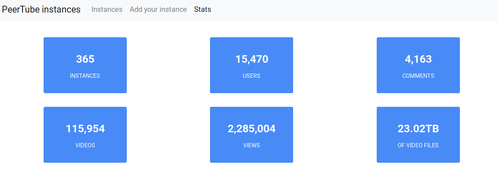

# PeerTube introduction

For a quick start, see:

* This [two-minute video](https://framatube.org/videos/watch/217eefeb-883d-45be-b7fc-a788ad8507d3) (hosted on PeerTube) explaining what PeerTube is and how it works
* PeerTube's project homepage, [joinpeertube.org](https://joinpeertube.org)
* Demonstration instances:
  * [peertube.cpy.re](https://peertube.cpy.re)
  * [peertube2.cpy.re](https://peertube2.cpy.re)
  * [peertube3.cpy.re](https://peertube3.cpy.re)
* This [video](https://peertube.cpy.re/videos/watch/da2b08d4-a242-4170-b32a-4ec8cbdca701) demonstrating the communication between PeerTube and [Mastodon](https://github.com/tootsuite/mastodon) (a decentralized Twitter alternative)

## What is PeerTube?

PeerTube is software that you install on a web server. It allows you to create a video hosting website, so create your "homemade YouTube".

The difference to YouTube is that it’s not intended to create a huge platform centralizing videos from the whole world on a single server farm (which is horribly expensive).

On the contrary, the concept of PeerTube is to create a network of multiple small interconnected video hosting providers.

[Getting started: What is PeerTube?](https://docs.joinpeertube.org/lang/en/userdocs/getting-started.html#toc-what-is-peertube)

PeerTube is unique because it’s the only video hosting web application which combines three advantages:

1. An open code (transparency) under a free/libre license  
→ ethic, respect and community-driven development

2. A federation of interconnected hosting providers   
→ so more video choices wherever you go to see them

3. Peer-to-peer broadcasting – and therefore viewing  
→ so no slowing down when a video becomes viral

## Why use PeerTube?

* Community-driven content creation, no obscure and ominous algorithm, designed by advertisers that drive content

* Not getting bullied by ContentID and losing days of revenue  
→ see also: [YouTube Blocks Blender Videos Worldwide](https://www.blender.org/media-exposure/youtube-blocks-blender-videos-worldwide/)

* No personal data tracking

[Getting started: Why do we need it?](https://docs.joinpeertube.org/lang/en/userdocs/getting-started.html#toc-why-do-we-need-it)

## Who uses PeerTube?

## When use PeerTube?

In october 2018, PeerTube published the first stable release. It is considered a basis stable enough to be broadly used and the main mechanics are in place. Not all use cases are covered and edges are still rough, but it should be pretty usable nonetheless.

[Roadmap Development 2019](https://github.com/Chocobozzz/PeerTube/projects/4)

## How to use PeerTube?

Install on any OS (except Windows):

* Arch Linux
* CentOS / Fedora / RHEL
* Debian / Ubuntu
* Docker
* FreeBSD        
* macOS
* YunoHost (Debian-based)

Software:

* Nginx (Web server)
* PostgreSQL (Database)
* Redis (Caching)
* FFmpeg (Transcoding)
* NodeJS (Javascript)
* Yarn (Dependency package manager)

Join PeerTube!

[#JoinPeerTube](https://joinpeertube.org/)

Wikipedia:

* https://en.wikipedia.org/wiki/PeerTube
* https://en.wikipedia.org/wiki/WebTorrent
* https://en.wikipedia.org/wiki/GNU_Affero_General_Public_License

